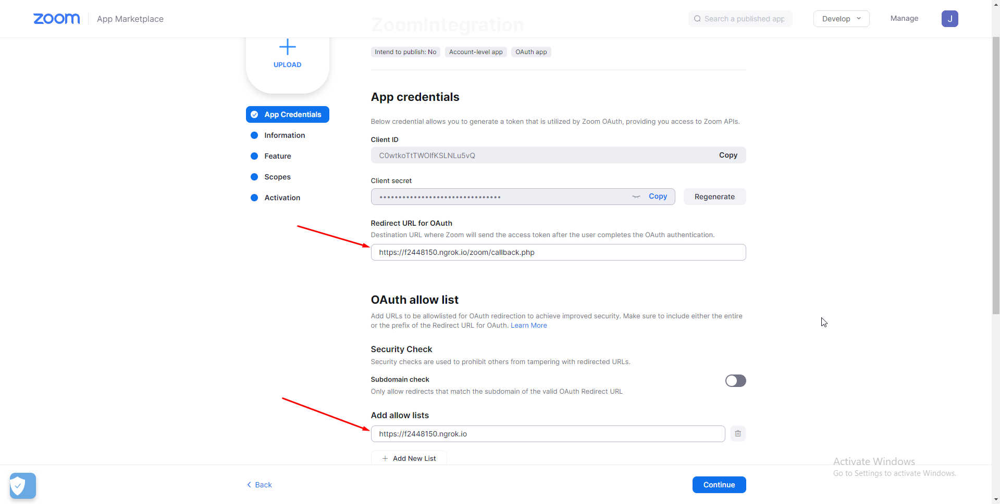

## Create an OAuth App on Zoom

Once you have your Zoom account, you need to create an OAuth app on Zoom using the below steps.

<ul>
    <li><a href="https://marketplace.zoom.us/develop/create"> Register your app </a> on Zoom APP Marketplace.</li>
    <li>Upon registering an app, you will get your generated credentials. Here you need to pass Redirect URL for OAuth and Whitelist URL.</li>
    <li>On the next step, enter the basic information about your app.</li>
    <li>In the tab, you can optionally enable some additional features such as Event Subscriptions and Chat Subscriptions for your app.</li>
    <li>Under the ‘Scopes’ tab, you need to add scopes regarding your app. For example, you can add a scope for Zoom meetings.</li>
    <li>If you are on localhost then use the ngrok and generate the local URL. In my case, ngrok URLs for OAuth redirection and Whitelist URL are as shown below.</li>
</ul>

## Basic Setup and Configuration
I didn’t find any PHP library which can be used to interact with the Zoom API. Doing some research I am able to manage it through the Guzzle library and Zoom REST API. Install the Guzzle library using the command:

### Installation

```
$ composer require guzzlehttp/guzzle

```

## Get started

To use the [Zoom API](https://marketplace.zoom.us/docs/guides/tools-resources/zoom-apis), you will need to register a Zoom app. Follow the [Create an OAuth App guide](https://marketplace.zoom.us/docs/guides/getting-started/app-types/create-oauth-app).

